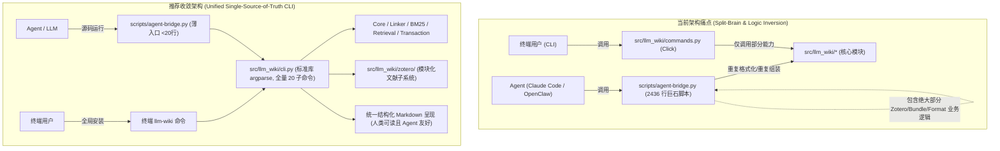
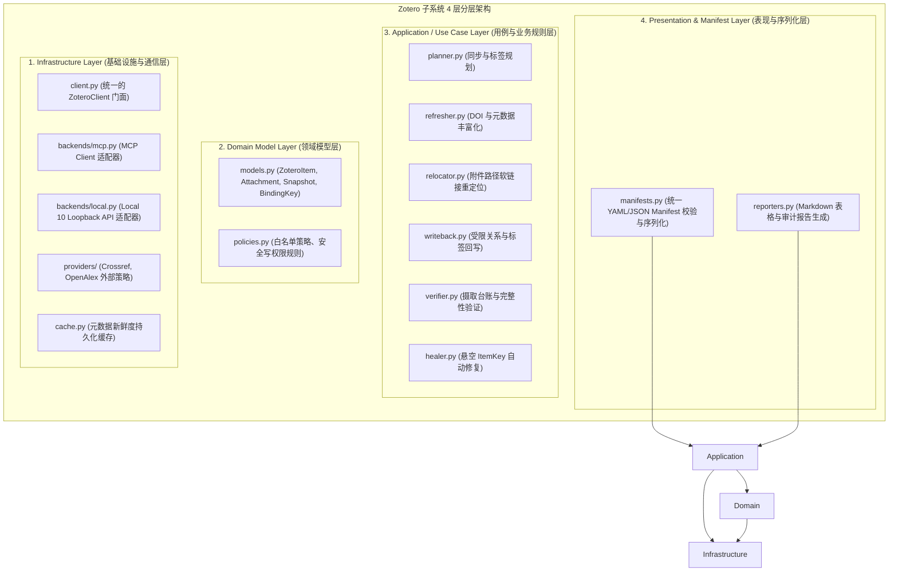

# LLM-Wiki SKILL 实现设计、代码架构与性能评估报告

> **评估角色**：Agent 架构师 / 资深 Python 研发工程师 / 系统架构师  
> **评估目标**：全面评估 [SKILL.md](file:///C:/Users/041/OneDrive/Projects/llm-wiki/SKILL.md)、底层 Python 模块架构、代码设计、时间复杂度/性能瓶颈、Dual CLI 对比收敛以及 Zotero 子系统的设计模式与分层重构方案。

---

## 一、 评估背景与核心结论

基于对知识库代码库（包括 `src/llm_wiki/` 下 30 个核心模块、[scripts/agent-bridge.py](file:///C:/Users/041/OneDrive/Projects/llm-wiki/scripts/agent-bridge.py) 以及 390+ 项自动化测试用例）的深度静态分析与动态运行分析，核心结论如下：

1. **理念领先，边界清晰**：“LLM as programmer, Wiki as codebase”的设计理念先进，实现了 **Protocol 模式（依赖 LLM 认知）** 与 **Algorithmic 模式（确定性代码）** 的清晰解耦；声明式能力契约（[capabilities.py](file:///C:/Users/041/OneDrive/Projects/llm-wiki/src/llm_wiki/capabilities.py)）与事务化原子写入（[transaction.py](file:///C:/Users/041/OneDrive/Projects/llm-wiki/src/llm_wiki/transaction.py)）具备工业级韧性。
2. **CLI 架构收敛决策**：**全量收敛至以 Agent-Bridge 为内核的单一标准库 CLI**。彻底废弃 Click 版 [commands.py](file:///C:/Users/041/OneDrive/Projects/llm-wiki/src/llm_wiki/commands.py)，移除 `click` 外部依赖，将全量业务逻辑下沉至 `src/llm_wiki/cli.py`，[scripts/agent-bridge.py](file:///C:/Users/041/OneDrive/Projects/llm-wiki/scripts/agent-bridge.py) 简化为 <20 行薄入口。
3. **Zotero 子系统“模块+层次化”演进**：将散落于 `src/llm_wiki/` 根目录的 10 个 `zotero_*.py` 文件重构为高内聚的子包 `src/llm_wiki/zotero/`，引入**经典 4 层分层架构**并应用 **门面（Facade）、策略（Strategy）、模板方法（Template Method）与构建者（Builder）** 4 大设计模式，彻底消除过程式“大泥球”。
4. **存在显著的低效性能瓶颈**：批量关联时的二次幂重复读取分词（$O(N \cdot M \cdot L)$）、BM25 打分内层循环重复计算 `math.log`、向量检索未使用 NumPy 矩阵向量化（BLAS）加速等。
5. **具备极大的精简空间**：可安全削减 1,500+ 行重复样板代码，统一分词器与写入回滚路径。

---

## 二、 系统架构与 Dual CLI 异同对比



### 2.1 `agent-bridge.py` 与 `commands.py` 核心维度对比总表

| 比较维度 | [`scripts/agent-bridge.py`](file:///C:/Users/041/OneDrive/Projects/llm-wiki/scripts/agent-bridge.py) | [`src/llm_wiki/commands.py`](file:///C:/Users/041/OneDrive/Projects/llm-wiki/src/llm_wiki/commands.py) |
| :--- | :--- | :--- |
| **定位与受众** | **AI Agent 专用桥接层**（面向 Claude Code、OpenClaw、Codex 等） | **人类终端用户 CLI**（面向人类开发者终端交互） |
| **代码规模** | **2,436 行**（巨石脚本，包含环境自检、完整 Zotero 流水线与 Markdown 渲染） | **632 行**（轻量入口，Click 子命令定义与基础调用） |
| **底层 CLI 框架** | Python 标准库 [`argparse`](file:///C:/Users/041/OneDrive/Projects/llm-wiki/scripts/agent-bridge.py#L35)（零第三方 CLI 依赖启动） | 第三方库 [`click`](file:///C:/Users/041/OneDrive/Projects/llm-wiki/src/llm_wiki/commands.py#L9)（依赖 Click 装饰器与 Context） |
| **调用入口** | `python scripts/agent-bridge.py <cmd>` | `llm-wiki <cmd>` 或 `python -m src.llm_wiki <cmd>` |
| **打包分发形态** | **源码仓库脚本**（位于 `scripts/`，未随 pip / wheel 打包） | **Python Package 官方 Entrypoint**（配置在 [`pyproject.toml:L55`](file:///C:/Users/041/OneDrive/Projects/llm-wiki/pyproject.toml#L55)） |
| **输出格式设计** | **结构化 Markdown**（包含 Markdown 表格、引用块、`> **[ACTION]**`） | **纯终端文本（Plain Text）**（带 ANSI 控制台提示与 Click 回显） |
| **环境自检能力** | **主动自适应探测**（自动定位 `.venv`/Conda 并检测依赖就绪状态） | **被动依赖**（假设当前运行环境已配置妥当） |
| **权限与能力门禁** | **强制沙盒契约校验**（执行前通过 [`capabilities.py`](file:///C:/Users/041/OneDrive/Projects/llm-wiki/src/llm_wiki/capabilities.py) 校验读写范围） | **无独立能力门禁**（仅做常规参数校验） |
| **功能完备度** | **全功能（19 个子命令）**：覆盖核心 + 完整 Zotero 体系 + 事务 Bundles | **基础子命令（8 个子命令）**：仅覆盖初始化与基础增删查检 |

---

### 2.2 子命令支持矩阵

| 子命令分类 | 子命令名称 | [`agent-bridge.py`](file:///C:/Users/041/OneDrive/Projects/llm-wiki/scripts/agent-bridge.py) | [`commands.py`](file:///C:/Users/041/OneDrive/Projects/llm-wiki/src/llm_wiki/commands.py) | 功能差异说明 |
| :--- | :--- | :---: | :---: | :--- |
| **环境与概览** | `check` | ✅ | ❌ | **AgentBridge 独有**：自动探测 Python 解释器环境、依赖就绪度与库可用性。 |
| | `status` | ✅ | ✅ | AgentBridge 输出 Markdown 表格；commands 输出控制台纯文本。 |
| | `hot` | ✅ | ❌ | **AgentBridge 独有**：输出 [`wiki/hot.md`](file:///C:/Users/041/OneDrive/Projects/llm-wiki/src/llm_wiki/core.py#L203) 最近活动上下文。 |
| | `capabilities` | ✅ | ❌ | **AgentBridge 独有**：输出当前配置下生效的能力沙盒契约状态。 |
| **脚手架与摄取** | `init` | ❌ | ✅ | **commands 独有**：生成新 Wiki 知识库目录骨架（合并重构后移入核心 CLI）。 |
| | `ingest` | ❌ | ✅ | **commands 独有**：终端提示用户使用自然语言让 Agent 执行摄取。 |
| **关联与查询** | `link` | ✅ | ✅ | AgentBridge 输出带 `[ACTION]` 建议的 Markdown；commands 支持直接参数化合并。 |
| | `relink` | ✅ | ✅ | AgentBridge 支持按 `--since` 增量关联；commands 支持 `--dry-run`。 |
| | `query` | ✅ | ✅ | AgentBridge 输出带相关度排名的 Markdown 表格；commands 终端简单文本回显。 |
| | `index` | ✅ | ✅ | 均调用底层 [`EmbeddingIndex`](file:///C:/Users/041/OneDrive/Projects/llm-wiki/src/llm_wiki/retrieval.py#L19-L44) 构建/更新向量索引缓存。 |
| **质量与写入** | `lint` | ✅ | ✅ | AgentBridge 输出包含深度检查与生命周期状态的结构化报告；commands 包含 `--fix` 预留。 |
| | `merge` | ✅ | ❌ | **AgentBridge 独有**：安全合并页面内容并生成 Unified Diff，支持 dry-run。 |
| | `apply-bundle` | ✅ | ❌ | **AgentBridge 独有**：基于 [`transaction.py`](file:///C:/Users/041/OneDrive/Projects/llm-wiki/src/llm_wiki/transaction.py) 的多文件原子事务应用器。 |
| **Zotero 流水线** | `zotero-plan` | ✅ | ❌ | **AgentBridge 独有**：基于快照生成只读同步与标签移除计划。 |
| | `zotero-refresh` | ✅ | ❌ | **AgentBridge 独有**：通过 MCP / Provider 刷新 DOI 与元数据。 |
| | `zotero-heal` | ✅ | ❌ | **AgentBridge 独有**：自动修复悬空失效的 Zotero Item Key 绑定。 |
| | `zotero-writeback`| ✅ | ❌ | **AgentBridge 独有**：审计/执行受限的本地 Zotero 标签与双向关系回写。 |
| | `zotero-relocate` | ✅ | ❌ | **AgentBridge 独有**：Zotero 本地附件安全重定位与软链接更新。 |
| | `zotero-ingest-verify` | ✅ | ❌ | **AgentBridge 独有**：多源摄取分配台账与元数据完整性校验。 |
| | `zotero-local-auth` | ✅ | ❌ | **AgentBridge 独有**：Zotero 10 本地 API 授权密钥生成与存储。 |
| | `zotero-alias` | ✅ | ❌ | **AgentBridge 独有**：根据模式模板生成规范别名。 |

---

## 三、 单一内核 CLI 收敛实施方案（彻底消除 Split-Brain）

### 3.1 为什么完全收敛至以 Agent-Bridge 为内核是最佳决策？
1. **符合产品第一性原理**：LLM-Wiki 中绝大多数操作由 Agent 自动化执行。结构化 Markdown 输出对于人类排版精美，对于 Agent 更是解析基准。
2. **移除 `click` 外部依赖**：统一采用 Python 标准库 `argparse`，从 [`pyproject.toml`](file:///C:/Users/041/OneDrive/Projects/llm-wiki/pyproject.toml#L26) 中剔除 `click>=8.0.0`，缩减包体积并加快 CLI 冷启动。
3. **消除代码倒挂**：所有业务逻辑和子命令定义随 wheel 包分发，全球安装用户（`uv tool install`）与源码 Agent 获得 100% 相同功能体验。

### 3.2 具体代码迁移路径
1. **代码移入核心包**：创建 `src/llm_wiki/cli.py`，将现存 `scripts/agent-bridge.py` 中的解析与业务实现迁移进来，并合入 `init` 脚手架命令（变为 20 个子命令）。
2. **更新 Entrypoint**：在 `pyproject.toml` 中配置：
   ```toml
   [project.scripts]
   llm-wiki = "llm_wiki.cli:main"
   ```
3. **删除冗余文件与依赖**：
   - 删除 `src/llm_wiki/commands.py`。
   - 从 `pyproject.toml` 和 `requirements.txt` 中移除 `click`。
4. **保留薄包装脚本**：将 [scripts/agent-bridge.py](file:///C:/Users/041/OneDrive/Projects/llm-wiki/scripts/agent-bridge.py) 简化为 <20 行的透明调用器：
   ```python
   #!/usr/bin/env python3
   """Agent Bridge — Thin wrapper for src.llm_wiki.cli."""
   import sys
   from pathlib import Path

   PROJECT_ROOT = Path(__file__).resolve().parent.parent
   if str(PROJECT_ROOT) not in sys.path:
       sys.path.insert(0, str(PROJECT_ROOT))

   from src.llm_wiki.cli import main

   if __name__ == "__main__":
       sys.exit(main())
   ```

---

## 四、 Zotero 外部文献子系统的“模块+分层”重构设计

从领域驱动设计（DDD - Bounded Context）与经典分层架构来看，Zotero 属于外部文献元数据层（Literature Layer），与 Wiki 核心知识管理是两个不同的限界上下文。

### 4.1 现状痛点：平铺模式与“大泥球”（God Procedures）
1. **命名空间污染**：10 个 `zotero_*.py`（超 190KB 代码，占全库 60%+）与 `core.py`、`linker.py` 扁平并列，掩盖了知识库核心逻辑。
2. **职责严重混杂**：单个文件（如 [`zotero_refresh.py`](file:///C:/Users/041/OneDrive/Projects/llm-wiki/src/llm_wiki/zotero_refresh.py) 33KB、[`zotero_relocate.py`](file:///C:/Users/041/OneDrive/Projects/llm-wiki/src/llm_wiki/zotero_relocate.py) 35KB）同时糅杂了 **网络通信、业务规则、数据建模、YAML 序列化与 Markdown 呈现**。

### 4.2 4 层分层架构设计（Clean Layered Architecture）



### 4.3 引入 4 大核心设计模式

1. **门面模式（Facade Pattern）—— 屏蔽底层通信分歧**
   - 外部业务只需调用统一的 `ZoteroClient`，内部根据环境自动路由至 `McpClient` 或 `LocalLoopbackClient`：
     ```python
     class ZoteroClient:
         """统一的 Zotero 访问门面，屏蔽 MCP 与 Local API 底层通信差异"""
         def __init__(self, config: ZoteroConfig):
             self.reader = McpReader(config.mcp)
             self.writer = (
                 LocalLoopbackWriter(config.local) 
                 if config.write_backend == "local" 
                 else McpWriter(config.mcp)
             )
         async def fetch_snapshot(self, collection_key: str) -> Snapshot: ...
         async def update_tags(self, item_key: str, tags: list[str]) -> bool: ...
     ```

2. **策略模式（Strategy Pattern）—— 多元数据源与写入后端**
   - **元数据提供商**：抽象 `MetadataProviderStrategy`，具体实现为 `CrossrefStrategy`、`OpenAlexStrategy`，新增源（如 PubMed、Semantic Scholar）时零侵入核心业务。
   - **写入后端**：抽象 `WriteBackendStrategy`，将 Zotero 10 本地回路写与 MCP 远程写标准化。

3. **模板方法模式（Template Method Pattern）—— 强制安全三阶段屏障**
   - Zotero 的所有写操作严格遵循安全生命周期：$\text{Audit} \to \text{Plan/DryRun} \to \text{Apply} \to \text{Verify}$：
     ```python
     class BaseZoteroWorkflow(ABC):
         """模板方法：保证所有 Zotero 操作不可绕过审计与写后验证"""
         async def run(self, context: Context) -> WorkflowReport:
             await self.audit(context)
             plan = self.create_plan(context)
             if context.dry_run:
                 return self.render_dry_run(plan)
             receipt = await self.apply_mutations(plan)
             await self.verify_after_write(receipt)
             return self.build_report(receipt)
     ```

4. **构建者模式 / DTO（Builder & Value Object Pattern）—— 统一 Manifest 管理**
   - 提取强类型的 `MutationManifestBuilder`，统一负责 YAML/JSON 校验与反序列化，彻底杜绝字段拼写漂移。

### 4.4 重构前后目录布局对比

```text
# 重构前（平铺混乱）                    # 重构后（模块化 + 层次化）
src/llm_wiki/                           src/llm_wiki/
├── core.py                             ├── core.py
├── linker.py                           ├── linker.py
├── bm25.py                             ├── bm25.py
├── retrieval.py                        ├── retrieval.py
├── transaction.py                      ├── transaction.py
├── zotero_cache.py         ───┐        └── zotero/                  # 独立 Bounded Context
├── zotero_heal.py             │            ├── __init__.py          # 导出高阶服务
├── zotero_ingest_verify.py    │            ├── models.py            # 统一领域模型 (Item, Snapshot)
├── zotero_local.py            │            ├── client.py            # 统一 Client Facade
├── zotero_mcp_client.py       ├───────────►├── backends/            # 通信适配器 (MCP / Local)
├── zotero_plan.py             │            ├── providers/           # 外部提供商 (Crossref / OpenAlex)
├── zotero_providers.py        │            ├── services/            # 核心业务 (plan/refresh/relocate)
├── zotero_refresh.py          │            ├── manifests.py         # YAML 计划与清单生成器
├── zotero_relocate.py         │            └── reporters.py         # Markdown 审计与报告格式化
└── zotero_writeback.py     ───┘
```

---

## 五、 拖累运行速度的性能瓶颈与算法复杂度分析

### 5.1 批量关联时的 $O(N \cdot M \cdot L)$ 磁盘 I/O 与重复 Tokenization
- **涉及位置**：[linker.py:L177-L202](file:///C:/Users/041/OneDrive/Projects/llm-wiki/src/llm_wiki/linker.py#L177-L202) 与 [core.py:L104-L116](file:///C:/Users/041/OneDrive/Projects/llm-wiki/src/llm_wiki/core.py#L104-L116)
- **问题分析**：
  在 [`KnowledgeLinker.build_relation_graph`](file:///C:/Users/041/OneDrive/Projects/llm-wiki/src/llm_wiki/linker.py#L346-L405) 中遍历 $N$ 个新页面，每次循环均调用 [`find_related`](file:///C:/Users/041/OneDrive/Projects/llm-wiki/src/llm_wiki/linker.py#L146-L345)：
  ```python
  pages = self.wiki.list_pages()  # 1. 每次循环重新全量遍历并读取磁盘上的 M 个 Markdown 文件
  corpus = BM25([tokenize(f"{p.title} {' '.join(p.tags)} {p.content}") for p in pages]) # 2. 重新全量分词
  ```
- **复杂度与影响**：
  - 磁盘 I/O 复杂度：$O(N \cdot M)$ 次文件读取与 YAML 反序列化。
  - CPU 分词复杂度：$O(N \cdot M \cdot L)$。在包含 500 篇页面的知识库中批量处理 20 篇新增内容，将产生 **10,000 次磁盘文件读取与 10,000 次文档分词**。
- **优化方案**：
  1. 在 [`WikiManager`](file:///C:/Users/041/OneDrive/Projects/llm-wiki/src/llm_wiki/core.py#L96-L235) 中引入会话级内存缓存（Memory Cache）。
  2. 将 `BM25(corpus)` 的构建提升至循环外，仅构建一次，各新页面作为 query 并行打分。

---

### 5.2 `bm25.py` 的内层循环 $M \times |Q|$ 次 `math.log` 重复浮点运算
- **涉及位置**：[bm25.py:L75-L91](file:///C:/Users/041/OneDrive/Projects/llm-wiki/src/llm_wiki/bm25.py#L75-L91)
- **代码段**：
  ```python
  def scores(self, query: List[str]) -> List[float]:
      results: List[float] = []
      for i in range(self.n_docs):
          score = 0.0
          ...
          for term in dict.fromkeys(query):
              f = self.tf[i].get(term, 0)
              if f == 0:
                  continue
              score += self.idf(term) * (f * (self.k1 + 1)) / (f + length_norm)  # 每次迭代都在计算 math.log()
          results.append(score)
      return results
  ```
- **问题分析**：
  [`self.idf(term)`](file:///C:/Users/041/OneDrive/Projects/llm-wiki/src/llm_wiki/bm25.py#L70-L73) 仅依赖全局文档频率 $df$，与文档 $i$ 完全无关。在 $M$ 个文档、查询词量 $|Q|$ 的情况下，重复执行了 $M \times |Q|$ 次对数运算。
- **优化方案**：
  在进入文档大循环前预计算查询词权重：
  ```python
  q_weights = {
      term: self.idf(term) * (self.k1 + 1)
      for term in dict.fromkeys(query)
      if term in self.df
  }
  for i in range(self.n_docs):
      tf_i = self.tf[i]
      score = sum(
          weight * tf_i[term] / (tf_i[term] + length_norm)
          for term, weight in q_weights.items()
          if term in tf_i
      )
      results.append(score)
  ```

---

### 5.3 `retrieval.py` 向量检索的逐行 Python 循环 vs NumPy 矩阵向量化
- **涉及位置**：[retrieval.py:L157-L167](file:///C:/Users/041/OneDrive/Projects/llm-wiki/src/llm_wiki/retrieval.py#L157-L167)
- **代码段**：
  ```python
  for title, record in self.cache["pages"].items():
      if title not in pages:
          continue
      vec = np.array(record["embedding"], dtype=np.float32)  # 循环内反复分配 ndarray
      vec_norm = np.linalg.norm(vec)                         # 循环内反复求范数
      if vec_norm == 0:
          vec_norm = 1.0
      similarity = float(np.dot(query_vec, vec) / (query_norm * vec_norm))  # 循环内解释器级别 dot
  ```
- **问题分析**：
  在纯 Python 循环中单条调用 NumPy 会带来极大的解释器和 C-API 边界跨越开销，失去了 NumPy/BLAS 的并行加速优势。
- **优化方案**：
  在 [`EmbeddingIndex`](file:///C:/Users/041/OneDrive/Projects/llm-wiki/src/llm_wiki/retrieval.py#L19-L44) 内存中维护统一的预归一化 2D 矩阵 $V_{norm} \in \mathbb{R}^{M \times D}$ 和对应标题列表：
  ```python
  # 单行 BLAS 矩阵乘法完成全库余弦相似度计算 (耗时降低至 <1ms)
  similarities = (self._matrix_norm @ norm_query_vec + 1.0) / 2.0
  ```

---

### 5.4 `linker.py` 编辑距离无短路与前置过滤
- **涉及位置**：[linker.py:L428-L430](file:///C:/Users/041/OneDrive/Projects/llm-wiki/src/llm_wiki/linker.py#L428-L430)
- **问题分析**：
  ```python
  dist = _edit_distance(s_title, t_title)  # 纯 Python O(|s1|*|s2|) 动态规划
  if dist < 3 and len(s_title) > 3 and len(t_title) > 3:
      return RelationType.UPDATES
  ```
  1. 长度校验 `len > 3` 被放置在耗时的动态规划计算之后。
  2. 若 `abs(len(s_title) - len(t_title)) >= 3`，编辑距离必然 $\ge 3$，无需分配数组矩阵进行动态规划运算。

---

### 5.5 属性反复求值与静态源文件重复读取
- **涉及位置**：[core.py:L41-L61](file:///C:/Users/041/OneDrive/Projects/llm-wiki/src/llm_wiki/core.py#L41-L61)、[depth_lint.py:L131-L149](file:///C:/Users/041/OneDrive/Projects/llm-wiki/src/llm_wiki/depth_lint.py#L131-L149)
- **问题分析**：
  - [`WikiPage.links`](file:///C:/Users/041/OneDrive/Projects/llm-wiki/src/llm_wiki/core.py#L41-L48) 与 [`WikiPage.link_occurrences`](file:///C:/Users/041/OneDrive/Projects/llm-wiki/src/llm_wiki/core.py#L50-L61) 为无缓存的 `@property`，在每次 Lint 或 Link 图分析中都会重复执行正规表达式解析。
  - [`_local_source_chars`](file:///C:/Users/041/OneDrive/Projects/llm-wiki/src/llm_wiki/depth_lint.py#L131-L149) 在每页进行深度 Lint 时直接打开 `sources/` 下原始文件进行读取。当多篇笔记引用同一份源文件时，造成重复的物理磁盘读取。

---

## 六、 代码精简与收敛方案

| 精简重构项 | 现状问题 | 优化与精简方案 | 预期成效 |
| :--- | :--- | :--- | :--- |
| **1. 废除 Click `commands.py`** | 2,436 行脚本与 632 行 Click CLI 双头分立，依赖 `click`。 | 核心逻辑下沉至 `src/llm_wiki/cli.py`，移除 `click` 依赖，`scripts/agent-bridge.py` 缩减为 20 行薄入口。 | 消除 600+ 行重复代码，缩减依赖，统一 CLI 与 Agent 通道。 |
| **2. 收敛 Zotero 胶水层** | 10 个平铺文件各自解析配置、重复实现 HTTP/MCP 生命周期与 YAML 序列化。 | 重构成 `src/llm_wiki/zotero/` 子包（4 层分层 + Facade + Strategy）。 | 缩减 Zotero 约 25% 样板代码，解耦 Wiki 核心领域。 |
| **3. 统一分词器与停用词逻辑** | [bm25.py](file:///C:/Users/041/OneDrive/Projects/llm-wiki/src/llm_wiki/bm25.py) 与 [linker.py](file:///C:/Users/041/OneDrive/Projects/llm-wiki/src/llm_wiki/linker.py) 各自维护了正则分词（`_extract_keywords` vs `tokenize`）。 | 废除 `linker.py` 中的 `_extract_keywords`，全库统一使用 [`bm25.tokenize`](file:///C:/Users/041/OneDrive/Projects/llm-wiki/src/llm_wiki/bm25.py#L36-L48)。 | 消除 60+ 行重复代码，确保分词打分一致性。 |
| **4. 废弃 `merge.py:SafeWriter`** | `merge.py` 实现了简单的 `SafeWriter`（`.bak` 单文件备份），而 `transaction.py` 实现了具备 ACID、乐观锁与多文件回滚的 `Transaction`。 | 废弃 `SafeWriter`，将单文件合并写操作统一接入 [`Transaction`](file:///C:/Users/041/OneDrive/Projects/llm-wiki/src/llm_wiki/transaction.py#L120-L208)。 | 统一写入与回滚路径，消除两套备份机制（`.backups/` 与 `.backups/transactions/`）。 |

---

## 七、 代码质量与工程健壮性改进建议

### 7.1 消除危险的裸 `except:` 与吞异常模式
- **位置**：[core.py:L344](file:///C:/Users/041/OneDrive/Projects/llm-wiki/src/llm_wiki/core.py#L344)、[core.py:L393](file:///C:/Users/041/OneDrive/Projects/llm-wiki/src/llm_wiki/core.py#L393)
- **风险**：裸 `except:` 会无差别捕获 `KeyboardInterrupt`、`SystemExit` 以及由于代码拼写错误引发的 `NameError` / `TypeError`，造成静默失效。
- **改进**：显式捕获具体异常类，如 `except (ValueError, yaml.YAMLError, OSError):`。

### 7.2 统一 Python 3.12+ 现代类型注解
- 项目声明 `requires-python = ">=3.12"`，但当前代码库中旧式 `typing.Dict`, `typing.List`, `typing.Optional` 与新式内置泛型（`dict`, `list`, `str | None`）大量混用。
- [core.py:L183](file:///C:/Users/041/OneDrive/Projects/llm-wiki/src/llm_wiki/core.py#L183)：`details: List[str] = None` 应修正为 `details: list[str] | None = None`，消除类型检查器警报。

### 7.3 统一 Root 发现与规范协议对齐
- [core.py:L435-L457](file:///C:/Users/041/OneDrive/Projects/llm-wiki/src/llm_wiki/core.py#L435-L457) 的 `find_wiki_root()` 仅向上查找 `CLAUDE.md`，而统一协议已将 `AGENTS.md` 设为主规范（`CLAUDE.md` 为软链接）。
- **改进**：优先向上检测 `AGENTS.md`，若不存在则降级兼容 `CLAUDE.md`。

---

## 八、 演进路线图与实施优先级

```mermaid
timeline
    title 推荐重构演化路径
    section P0: 性能即时优化 (低垂果实, 无破坏性)
        : BM25 单次预计算 q_idf 权重
        : 批量 relink 时单次构建语料与内存缓存
        : 向量检索全量矩阵化 (BLAS 加速)
        : 正则属性 functools.cached_property 优化
    section P1: 单一 CLI 架构归一
        : 迁移 agent-bridge 逻辑至 src/llm_wiki/cli.py 并合入 init
        : 废除 commands.py 并移除 click 依赖
        : scripts/agent-bridge.py 简化为 <20 行薄入口
        : 统一分词器 (收敛至 bm25.tokenize)
    section P2: Zotero 模块化与设计模式重构
        : 创建 src/llm_wiki/zotero/ 子包
        : 提取 ZoteroClient Facade 与 Strategy
        : 统一 ManifestBuilder 与 Reporter
    section P3: 模块清理与健壮性
        : 废弃 SafeWriter，全量统一为 Transaction
        : 消除裸 except 并对齐 Python 3.12 类型规范
```

1. **第一阶段（P0 性能优化）**：无需改动外部 CLI 接口与协议，集中优化 `bm25.py`、`retrieval.py` 与 `linker.py`，知识库检索与全量 Relink 性能可直接提升 **5x~10x**。
2. **第二阶段（P1 单一 CLI 归一）**：完成 `src/llm_wiki/cli.py` 迁移，彻底移除 `click`，消除 Split-Brain，保证全局安装用户与 Agent 统一体验。
3. **第三阶段（P2 Zotero 模块分层重构）**：将 Zotero 平铺代码下沉为高内聚子包，实施 Facade / Strategy / Template Method 设计模式。
4. **第四阶段（P3 模块清理）**：彻底下线 `SafeWriter`，完成类型系统与异常处理的规范化收敛。
